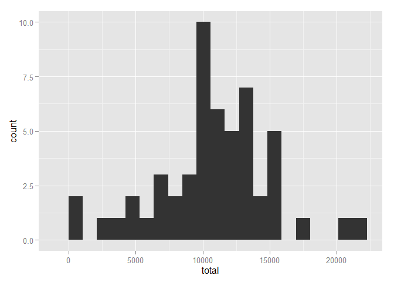
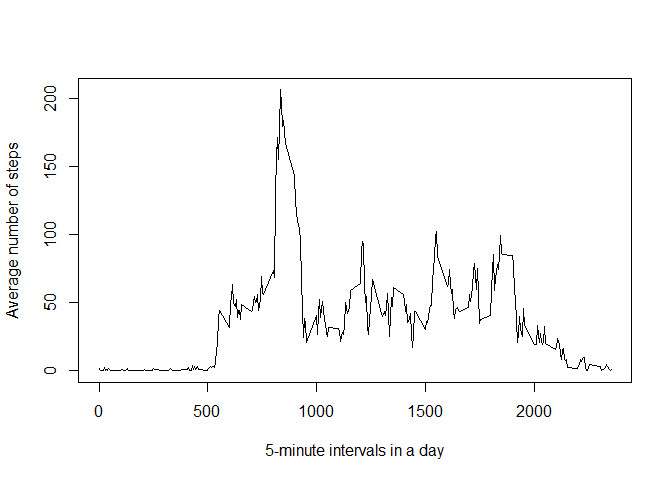
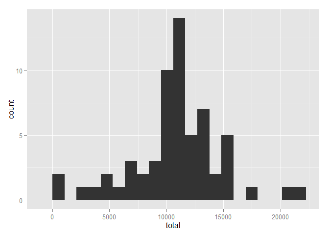
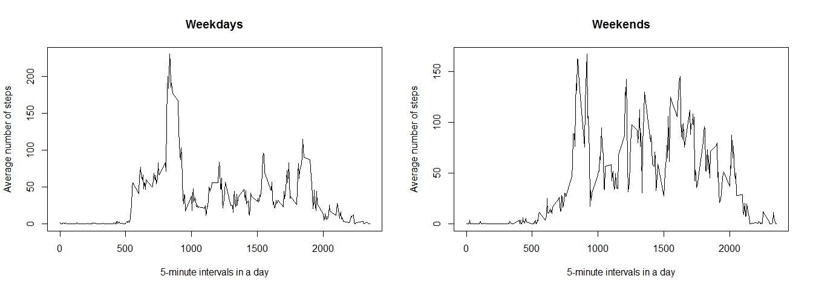

# Reproducible Research: Peer Assessment 1


## Loading and preprocessing the data

1. Load the data


```r
if (file.exists("activity.csv") == FALSE) {unzip("activity.zip")}
data <- read.table("activity.csv", header = TRUE, sep = ",", na.strings = NA)
```

2. Process/transform the data into a format suitable for your analysis


```r
data$date <- as.Date(data$date)
```

## What is mean total number of steps taken per day?

1. Calculate the total number of steps taken per day


```r
data_total <- data[complete.cases(data[c("steps", "date")]), ]
library(plyr)
data_total <- ddply(data_total, .(date), summarize, total = sum(steps))
```

2. Make a histogram of the total number of steps taken each day


```r
library(ggplot2)
qplot(total, data = data_total, binwidth = max(data_total$total)/20)
```

 

3. Calculate and report the mean and median of the total number of steps taken per day


```r
mean(data_total$total)
```

```
## [1] 10766.19
```

```r
median(data_total$total)
```

```
## [1] 10765
```

## What is the average daily activity pattern?

1. Calculate average number of steps taken in each 5-minute interval, averaged across all days


```r
data_avg_int <- data[complete.cases(data[c("steps", "interval")]), ]
library(plyr)
data_avg_int <- ddply(data_avg_int, .(interval), summarize, avg_steps = mean(steps))
```

2. Make a time series plot of the 5-minute interval (x-axis) and the average number of steps taken, averaged across all days (y-axis)


```r
plot(data_avg_int$interval, data_avg_int$avg_steps,
     type = "l",
     xlab = "5-minute intervals in a day",
     ylab = "Average number of steps")
```

 

3. Which 5-minute interval, on average across all the days in the dataset, contains the maximum number of steps?


```r
data_avg_int[data_avg_int$avg_steps == max(data_avg_int$avg_steps), "interval"]
```

```
## [1] 835
```

## Imputing missing values

1. Calculate and report the total number of missing values in the dataset


```r
na_num <- sum(!complete.cases(data))
na_num
```

```
## [1] 2304
```

2. Devise a strategy for filling in all of the missing values in the dataset.

_I am going to fill in all of the missing values in the dataset using the mean for that 5-minute interval, because there is no such 5-minute interval that has no data at all. To check that I can find all possible proportions of NAs across intervals._


```r
unique(ddply(data, .(interval), summarize, na_proportion = sum(is.na(steps)/length(steps)))$na_proportion)
```

```
## [1] 0.1311475
```

_All intervals happen to have the same proportion of NAs among their values._

3. Create a new dataset that is equal to the original dataset but with the missing data filled in.


```r
data_no_na <- data
NAs <- !complete.cases(data_no_na)
data_na <- data_no_na[NAs, ]
for (i in 1:na_num) {
  data_na$steps[i] <- data_avg_int[data_avg_int$interval == data_na$interval[i], ]$avg_steps
  }
data_no_na[NAs, ] <- data_na
rm(data_na, NAs)
```

4. Make a histogram of the total number of steps taken each day.


```r
library(plyr)
library(ggplot2)
data_no_na_total <- ddply(data_no_na, .(date), summarize, total = sum(steps))
qplot(total, data = data_no_na_total, binwidth = max(data_no_na_total$total)/20)
```

 

5. Calculate and report the mean and median total number of steps taken per day.


```r
mean(data_no_na_total$total)
```

```
## [1] 10766.19
```

```r
median(data_no_na_total$total)
```

```
## [1] 10766.19
```

6. Do these values differ from the estimates from the first part of the assignment?

_The mean value remains the same, because I filled in the missing values using mean values for the corresponding 5-minute intervals, and all NAs in the original dataset were related only to those dates where there initially were no data at all._

_But the median changed as new dates that have values were added and a different value of total number of steps per day appeared to be the middle one._

7. What is the impact of imputing missing data on the estimates of the total daily number of steps?

_If there had been dates that had had NA values along with non-NA ones before I imputed the missing data, then all estimates of the total daily number of steps would have increaded. In this case only the median have increased for the reason stated in my answer to the previous question._

## Are there differences in activity patterns between weekdays and weekends?

1. Create a new factor variable in the dataset with two levels – “weekday” and “weekend” indicating whether a given date is a weekday or weekend day.


```r
library(plyr)
data_no_na <- mutate(data_no_na, weekday_or_weekend = factor(weekdays(data_no_na$date) %in% c("Saturday", "Sunday"),labels = c("weekday", "weekend")))
```

2. Make a panel plot containing a time series plot of the 5-minute interval (x-axis) and the average number of steps taken, averaged across all weekday days or weekend days (y-axis).


```r
data_avg_int_day <- ddply(data_no_na, .(interval, weekday_or_weekend), summarize, avg_steps = mean(steps))
par(mfrow = c(1, 2))
with(subset(data_avg_int_day,
            weekday_or_weekend == "weekday"),
     plot(interval, avg_steps,
          type = "l",
          xlab = "5-minute intervals in a day",
          ylab = "Average number of steps",
          main = "Weekdays"))
with(subset(data_avg_int_day,
            weekday_or_weekend == "weekend"),
     plot(interval, avg_steps,
          type = "l",
          xlab = "5-minute intervals in a day",
          ylab = "Average number of steps",
          main = "Weekends"))
```

 
